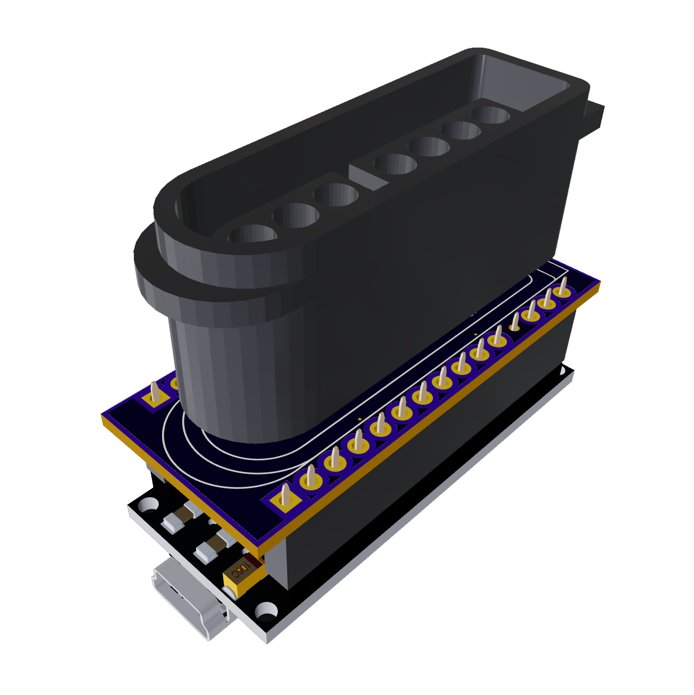

# SNESpad for Arduino and PicoSDK

This is a library for the Raspberry Pi Pico that allows it to interface with SNES controller peripherals. This library was adapted from the Arduino SNESpad library, with changes to optimize performance, add support for more SNES device types, and compatibility with the Pico SDK.

## Original Library

This library is based on the [nespad](https://github.com/rahji/nespad) library developed by rahji. The original library was designed for the Arduino platform.

## Features

This library allows for the reading of button states from a SNES controller connected to a Pico or Arduino. It supports standard SNES controller, the NES controller, the SNES Mouse, and even the SNES XBand Keyboard. Each of these devices can be identified and read by this library.

## Usage

1. Include the SNESpad.h header in your program.
2. Create a SNESpad object, specifying the clock, latch, and data pin numbers.
3. Use the `begin()` and `start()` function to initialize the SNESpad.
4. Use the `poll()` function to update the state of the SNESpad.
5. You can then read the state of the buttons and the direction pad using the appropriate members of the SNESpad class.

## Button Variables

Here are the members of the SNESpad class that hold the state of the buttons:

- `buttonA`
- `buttonB`
- `buttonX`
- `buttonY`
- `buttonStart`
- `buttonSelect`
- `buttonL`
- `buttonR`
- `directionUp`
- `directionDown`
- `directionLeft`
- `directionRight`

For the SNES Mouse, these additional variables are available:

- `mouseX`
- `mouseY`

## Example

Here is an example of how to create a SNESpad object and read the state of the buttons:

```cpp
#include "SNESpad.h"

#define CLOCK 0
#define LATCH 1
#define DATA0 2
#define DATA1 -1 // optional (required for super multitap, scope, xband keyboard, etc)
#define IOSEL -1 //

SNESpad snespad(CLOCK, LATCH, DATA0, DATA1, IOSEL);

void setup() {
    snespad.begin(); // init lib and gpio
    snespad.start(); // detect controller
}

void loop() {
    snespad.poll(); // poll for controller data

    if (snespad.buttonA) {
        printf("Button A is pressed.\n");
    }

    if (snespad.buttonB) {
        printf("Button B is pressed.\n");
    }

    // Add more button checks as needed.
}
```

This example will print a message to the console whenever button A or B is pressed.

## Author

This library was ported and substantially rewritten by Robert Dale Smith.

Email: <robert@robertdalesmith.com>

## Examples

Included in this repository are three examples that demonstrate different use cases for the SNESpad library.

1. [serial-print.ino](examples/serial-print/serial-print.ino) - Demonstrates how to use the SNESpad library to monitor all supported SNES peripherials over a USB serial monitor.

2. [hid-gamepad.ino](examples/picosdk-only/hid-gamepad/hid-gamepad.ino) - Demonstrates how to use the SNESpad library to create a RP2040 based HID USB gamepad.

3. [hid-mouse.ino](examples/hid-mouse/hid-mouse.ino) - Demonstrates how to use the SNESpad library to convert a Super NES mouse to USB HID mouse device.

4. [hid-keyboard.ino](examples/hid-keyboard/hid-keyboard.ino) - Demonstrates how to use the SNESpad library to create a SNES Xband Keyboard to USB HID keyboard device.

5. [xinput-gamepad.ino](examples/arduino-only/xinput-gamepad/xinput-gamepad.ino) - Demonstrates how to use the SNESpad library to create an Arduino XInput USB controller using a SNES controller or mouse.

6. [hid-gamepad-mouse-keyboard.ino](examples/arduino-only/hid-gamepad-mouse-keyboard/hid-gamepad-mouse-keyboard.ino) - Demonstrates how to use the SNESpad library to create an all-in-one mouse, keyboard and gamepad USB HID device for Arduino devices.

## Compatibility and Hardware

### SNES Peripherials

- [x] Generic SNES Controllers
- [x] Generic NES Controllers
- [x] Official Super NES Mouse
- [x] Hyperkin SNES Mouse
- [x] XBand Keyboard
- [ ] NTT Controller
- [ ] Super Multitap
- [ ] Konami Justifier
- [ ] Super Scope

### Microcontrollers

This project is designed with a custom PCB that interfaces the SNES pins with the GPIO of an Arduino Nano. The board uses a common pinout and is also compatible with any board that matches the Arduino Pro Micro footprint. 

While the serial example can work with any Arduino, the XInput and HID examples are limited to boards similar to the Arduino Pro Micro, due to the requirement of native USB support by the MCU.

You can find the open-source board design at Flux.ai:

[SNES Controller Arduino Nano Shield](https://www.flux.ai/robertdalesmith/snes-controller-arduino-nano-shield)



## Changes and Enhancements

This version of the library is optimized for performance and compatibility. Notable changes from the original Arduino version include:

- The control polling methods have been optimized to closely match the specifications of the original console.
- Added support for the Super Nintendo mouse and the original NES controllers.

## Version History

- Version: 2.0 (2023)
    - Extended to Pico SDK (Robert Dale Smith)
    - Total refactor of class structure. (Robert Dale Smith)
    - Mouse and NES controller support (Robert Dale Smith)

Below is a history of the original SNESpad library:

- Version: 1.3 (11/12/2010) - Removed shortcut constructor which was causing issues.
- Version: 1.2 (05/25/2009) - Put pin numbers in constructor (Pascal Hahn)
- Version: 1.1 (09/22/2008) - Fixed compilation errors in Arduino 0012 (Rob Duarte)
- Version: 1.0 (09/20/2007) - Created (Rob Duarte)

## License

This program is free software; you can redistribute it and/or modify it under the terms of the GNU Lesser General Public License as published by the Free Software Foundation; either version 3 of the License, or (at your option) any later version.

This program is distributed in the hope that it will be useful, but WITHOUT ANY WARRANTY; without even the implied warranty of MERCHANTABILITY or FITNESS FOR A PARTICULAR PURPOSE.  See the GNU Lesser General Public License for more details.

You should have received a copy of the GNU Lesser General Public License along with this program.  If not, see <http://www.gnu.org/licenses/>.
